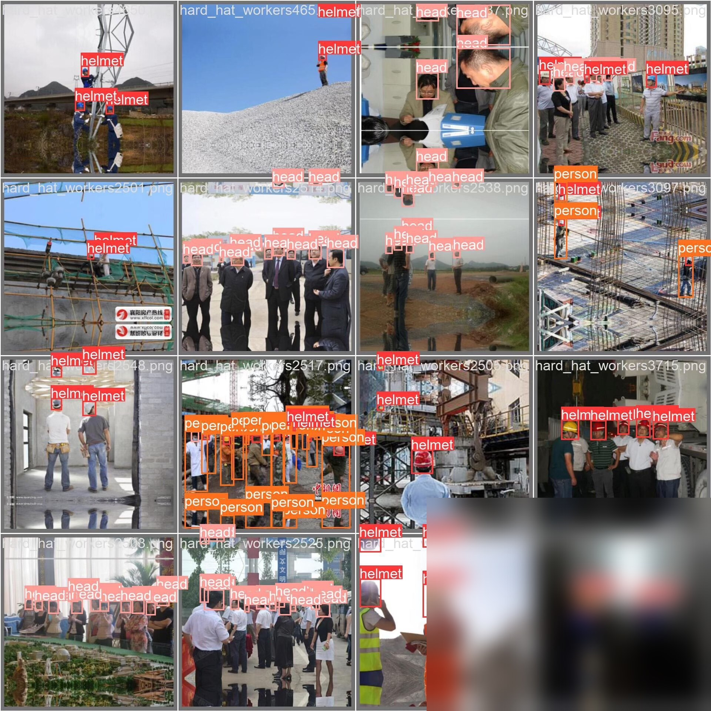

# Safety helmet and headgear detection dataset, 12000 images, suitable for target detection, recognition, etc.

## Body

Safety helmet and headgear detection dataset, 12000 images, suitable for target detection, recognition, etc. The dataset includes safety helmets with full annotations, in both VOC and YOLOF formats, ready to use directly.
Secure your purchase now, no refunds or exchanges allowed.
If you need it, just buy it! Feel free to message me for details (C055)

1. Converting VOCs as needed, and additional charges apply for model training services.

## Images

## Payment

Here is a pay link on Stripe ( https://buy.stripe.com/3cs8yP7sY87d0vu9AB ). Please contact me lonlonago@foxmail.com after funding $89, and I will send you a complete data files , thank you!

